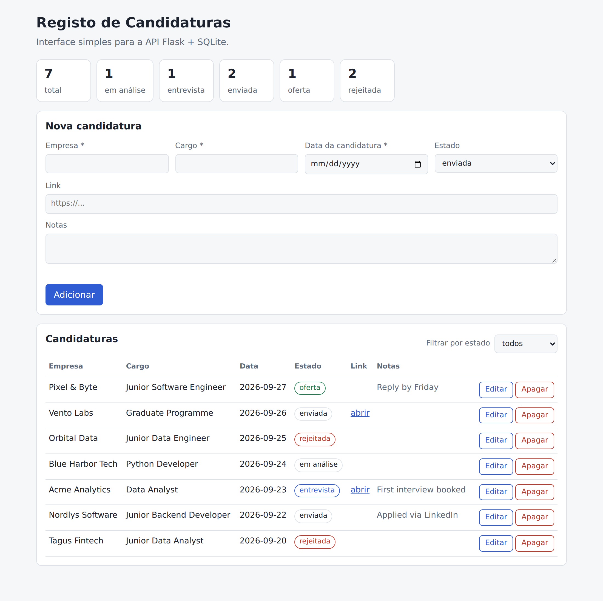

# Job Application Tracker (candidaturas-api)

A small web app to track job applications: a REST API built with Python, Flask and SQLite,
plus a simple web interface in plain HTML, CSS and JavaScript that uses the API.
It supports creating, listing, filtering, editing and deleting applications, and
shows basic statistics by status.

Portfolio project focused on backend development, built to complement my Data Analytics
portfolio with hands-on code for Junior Developer roles.



_Screenshot with sample data. The interface and the data fields are in Portuguese._

## Stack

- Python 3
- Flask
- SQLite (through Python's built-in `sqlite3`, no ORM)
- HTML, CSS and vanilla JavaScript (Fetch API), no frontend framework

## Run locally

```bash
python3 -m venv venv
source venv/bin/activate
pip install -r requirements.txt
python3 app.py
```

Then open `http://127.0.0.1:5000` in the browser.

## Web interface

The page at `/` is served by Flask and talks to the API with JavaScript (`fetch`). It lets you:

- list all applications, with a filter by status;
- add, edit and delete applications;
- see the statistics (total and count per status).

Validation errors returned by the API (for example, missing required fields) are shown
directly in the form. Text coming from the database is inserted with `textContent`, so any
HTML typed into a field is displayed as text and never executed.

Files: `templates/index.html`, `static/app.js`, `static/style.css`.

## Tests

```bash
python3 test_app.py
```

Uses Flask's test client (no running server needed) to test the home page, create, list,
get, update, delete, the statistics endpoint, validation errors and not-found cases.

## API endpoints

| Method | Endpoint                     | Description                                    |
|--------|------------------------------|------------------------------------------------|
| GET    | `/`                          | Web interface                                  |
| POST   | `/candidaturas`              | Create an application                          |
| GET    | `/candidaturas`              | List all (optional filter `?estado=`)          |
| GET    | `/candidaturas/<id>`         | Get one application by id                      |
| PUT    | `/candidaturas/<id>`         | Update fields of an application                |
| DELETE | `/candidaturas/<id>`         | Delete an application                          |
| GET    | `/estatisticas`              | Total and count per status                     |

Status codes: `201` on create, `204` on delete, `400` for invalid input, `404` when the
application does not exist.

### Example: create an application

```bash
curl -X POST http://127.0.0.1:5000/candidaturas \
  -H "Content-Type: application/json" \
  -d '{"empresa": "Cofidis", "cargo": "Generation Pro 2026", "data_candidatura": "2026-09-14"}'
```

Fields: `empresa` (company), `cargo` (role) and `data_candidatura` (application date) are
required; `estado` (status, default `"enviada"`, i.e. "sent"), `link` and `notas` (notes)
are optional.
